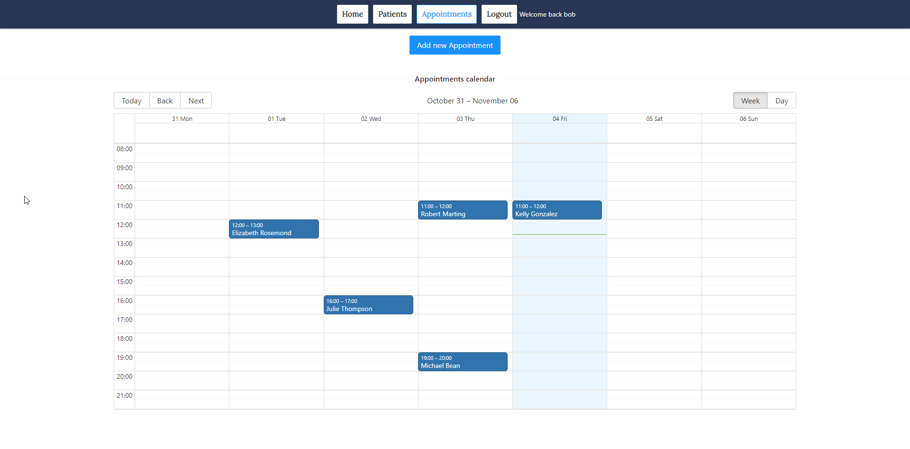

# Mypatients App

This project was created as part of the Web Development Bootcamp from Ironhack, to practice all the concepts learn during the module 3 of the Bootcamp implementing an application based on the MERN Stack (MongoDB Express React Node).

The application was planned as a website for therapists to have a blog site with articles and events, and also a common place to manage its patients and the appointments with them.

## How to run this application

In order to run this application you need to add this environment variable to the platform where the site will be running:

```
- REACT_APP_API_URL: With the domain of the api
```

# Demo

Find the live app [here](https://mypatients.netlify.app/)


<br/>

<br/>

<br/>


# Author

**Julian Bethge && Gabriel Gomez**

- [https://github.com/gabriel-vcs](https://github.com/gabriel-vcs)
- [https://github.com/JulianBethge](https://github.com/JulianBethge)

# License

Copyright © 2022, [Julian Bethge](https://github.com/JulianBethge), [Gabriel Gomez](https://github.com/gabriel-vcs).
Released under the [MIT License](LICENSE).

---
